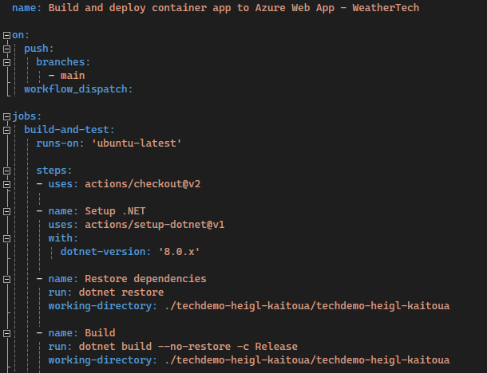
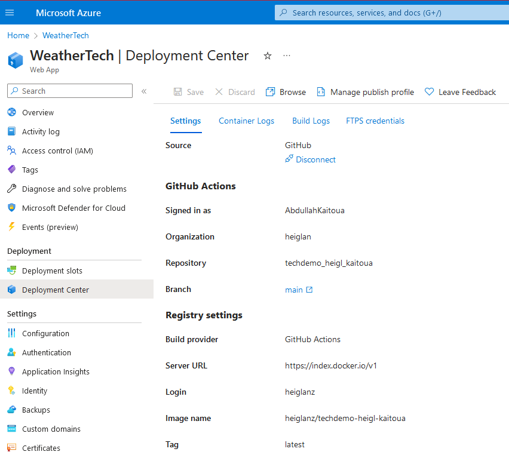
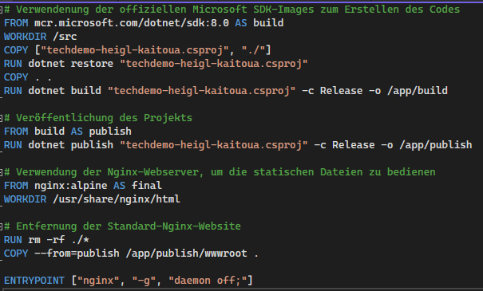
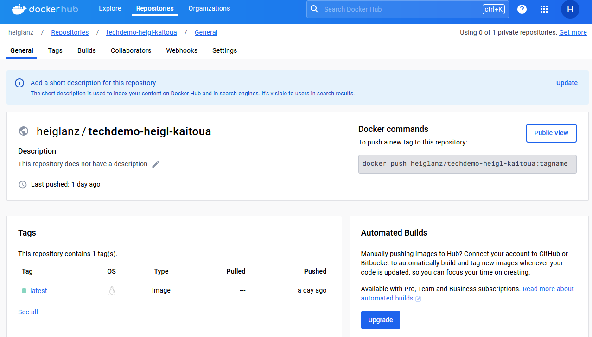
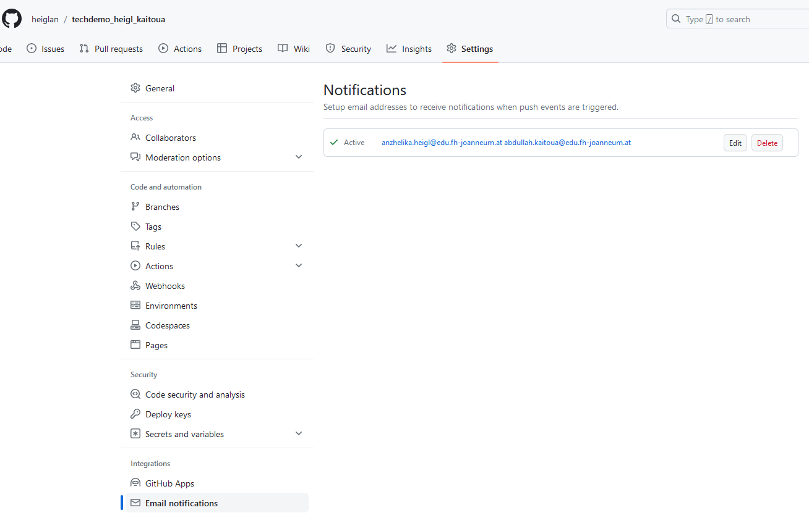
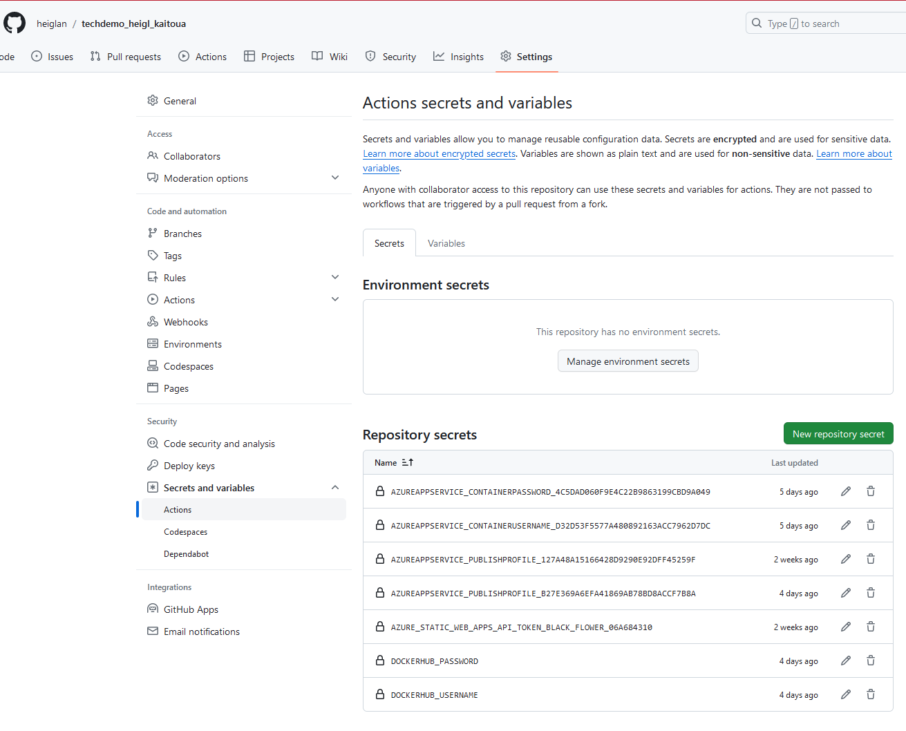
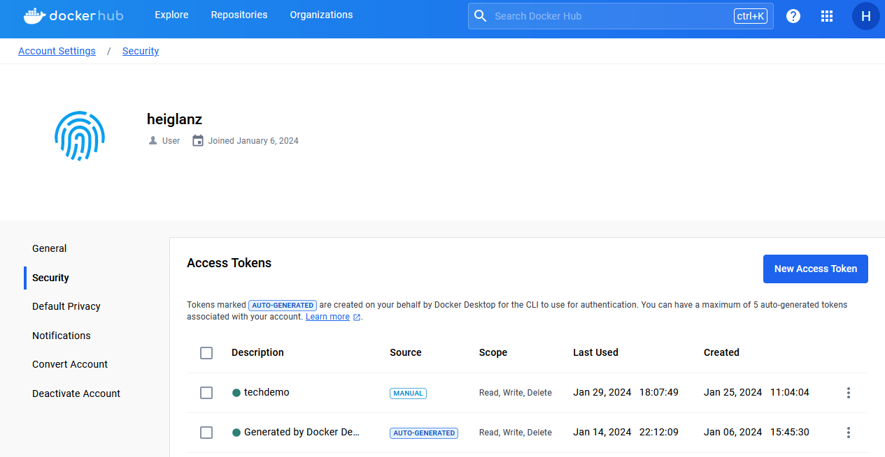

# techdemo_heigl_kaitoua

## Autoren

Abdullah Kaitoua, Anzhelika Heigl

## Checkliste :

### Einführung und Grundlagen
- [x] Verständnis von Continuous Delivery und dessen Bedeutung
- [x] Unterschiede zwischen Continuous Integration, Continuous Delivery und Continuous Deployment
- [x] CI-Anti Pattern identifizieren

Continuous Delivery ist eine Softwareentwicklungsmethode, bei der Codeänderungen automatisch gebaut, getestet und für die Produktion vorbereitet werden. Ziel ist es, Software schneller und zuverlässiger bereitzustellen.
Continuous Integration: Automatisches Zusammenführen von Code-Änderungen aus verschiedenen Branches ins Repository.
Continuous Delivery: Automatisches Bereitstellen aller Codeänderungen nach dem Durchlaufen der CI in einer Produktionsumgebung.
Continuous Deployment: Automatisches Release jeder Änderung direkt an die Kunden.

CI-Anti Patterns - Beispiele: 
**Infrequent Check-In:** Seltenes Einchecken von Source-Dateien verursacht Merge-Konflikte, verzögert Problemerkennung und hemmt die Teamarbeit. Lösung: Häufigere, kleinere Commits, Feature-Branches, regelmäßiges Aktualisieren und lokale Tests fördern Code-Qualität und Effizienz.

**Bottleneck Commits:** Das Einchecken von umfangreichen Code-Änderungen verursacht Integrationsbuild-Fehler, Verzögerungen und niedrigere Teammoral. **Lösung:** Regelmäßiges Commiten kleinerer Änderungen und Koordination mit Teammitgliedern.

**Continuous Ignorance:** Ein erfolgreiches Build bedeutet nicht zwangsläufig fehlerfreie Software. Es ist entscheidend, umfassende Tests bei jeder Änderung im Code durchzuführen, um mögliche Fehler frühzeitig zu erkennen.

**Scheduled Builds:** Das Festlegen von Zeitpunkten für Builds kann zu verzögerten Rückmeldungen führen. Es ist ratsam, Builds bei jeder Code-Änderung auszulösen, um eine schnellere Fehlererkennung zu ermöglichen.

**Impeding action with minimal feedback:** Die Nichtbenachrichtigung über Build-Fehler kann zu Verzögerungen bei der Fehlerbehebung führen. Daher ist es wichtig, effektive Feedback-Mechanismen zu implementieren, um das Team über den Build-Status zu informieren.

**Spam Feedback:** Die Überflutung von Teammitgliedern mit unnötigen Benachrichtigungen kann zu Informationsüberlastung führen. Es ist sinnvoll, gezielte und relevante Benachrichtigungen zu versenden, um die Reaktionsfähigkeit bei wichtigen Problemen sicherzustellen.

**Slow Machine:** Die Verwendung einer leistungsschwachen Arbeitsstation als Build-Maschine führt zu langen Build-Zeiten, was die Effizienz beeinträchtigt. Um schnelle Builds sicherzustellen, sollte die Build-Maschine über optimale Ressourcen wie Festplattengeschwindigkeit, Prozessor und RAM verfügen.


### Automatisierung
- [x] Automatisierte Builds eingerichtet
- [x] Automatisierte Tests implementiert
- [x] Automatisierte Deployments konfiguriert

Als Ausgangspunkt des Projekts wurde eine Blazor-App eingerichtet. 
Die App wurde in GitHub hochgeladen und eine Build-Pipeline mit GitHub Actions eingerichtet.

Nachdem das Projekt auf GitHub gepusht wurde, wurde eine YML-Datei für GitHub Actions im .github/workflows-Ordner erstellt.
Dies definiert den CI/CD-Prozess, der Builds, Tests und Deployments automatisiert.

Die YML-Datei enthält die folgenden Schritte:



- **Checkout**: Der aktuellste Code wird aus dem Main Branch des Repositories geholt.
- **.NET Setup**: Eine spezifische .NET-Version wird für den Build vorbereitet.
- **Restore Dependencies**: Abhängigkeiten werden basierend auf der `techdemo-heigl-kaitoua.csproj`-Datei wiederhergestellt.
- **Build**: Der Code wird im Release-Modus kompiliert, ohne erneutes Wiederherstellen der Abhängigkeiten.


### Testing
- [x] Unit Tests geschrieben und automatisiert
~~- [ ] Integrationstests implementiert (optional)~~
~~- [ ] End-to-End Tests eingerichtet (optional)~~

Das Projekt setzt auf Unit Tests, die mit dem xUnit-Framework geschrieben wurden, um die Funktionalität der einzelnen Komponenten zu gewährleisten. 

#### Konfiguration
- Das Testframework wird über NuGet-Abhängigkeiten im `UnitTests`-Projekt eingebunden.
- Wichtige Pakete umfassen `xunit`, `xunit.runner.visualstudio` und `Microsoft.NET.Test.Sdk`.
- Die Tests sind auf die Funktionsweise der Blazor-Komponenten ausgerichtet und überprüfen die Kernlogik der Anwendung.

#### Ausführung
- Um die Tests lokal durchzuführen, wird der Befehl `dotnet test` im `UnitTests`-Projektverzeichnis verwendet.
- In der CI/CD-Pipeline sorgt der gleiche Befehl für die Ausführung der Tests, und das Ergebnis wird zur Überprüfung der Codequalität verwendet.

#### Integration in die CI/CD-Pipeline
- Die Testausführung ist ein integraler Bestandteil des GitHub Actions Workflows.
- Bei jedem Push zum `main`-Branch werden die Tests automatisch ausgeführt, was eine kontinuierliche Qualitätssicherung ermöglicht.

Durch diese Konfiguration stellen wir sicher, dass jeder Codebeitrag den festgelegten Qualitätsstandards entspricht und die Anwendung stabil bleibt.


### Deployment-Strategien
- [x] Deployment-Strategien identifizieren
~~- [ ] Rollback-Strategien (optional)~~

Deployment-Strategien sind Pläne und Methoden, die verwendet werden, um Softwareänderungen sicher in der Produktionsumgebung zu veröffentlichen. Hier sind einige gängige Strategien:

    Blue-Green Deployment:
        Es gibt zwei identische Produktionsumgebungen (Blue und Green). Zu jedem Zeitpunkt ist eine davon live.
        Nach dem Deployment in der inaktiven Umgebung (z.B. Green) und nach erfolgreicher Prüfung wird der Verkehr von der aktiven (Blue) auf die inaktive (Green) umgeleitet.

    Canary Releases:
        Neue Änderungen werden zuerst nur an eine kleine Gruppe von Nutzern ausgerollt.
        Basierend auf dem Feedback und der Leistung wird das Update nach und nach an alle Benutzer verteilt.

    Rolling Deployment:
        Die Software wird schrittweise über mehrere Server oder Hosts ausgerollt.
        Dies minimiert die Downtime, da nicht alle Instanzen gleichzeitig aktualisiert werden.

    Feature Toggles (Feature Flags):
        Neue Features werden in der Codebase versteckt oder deaktiviert, bis sie vollständig getestet und bereit für die Freigabe sind.
        Die Features können dann für bestimmte Benutzer oder Umgebungen aktiviert werden, ohne neuen Code zu deployen.

In deinem Projekt wurde eine Strategie angewendet, die am ehesten einem Rolling Deployment ähnelt, da die Continuous Integration und Continuous Deployment (CI/CD) Pipeline automatisch neue Änderungen bereitstellt, 
sobald sie in den main-Branch des GitHub-Repository gepusht werden.

#### Azure Deployment

Für die Einrichtung des Deployments in Azure wurden folgende Schritte durchgeführt:

- **Einrichtung des Azure Web App Service:**
        Zuerst wurde eine Azure Web App erstellt, die als Hosting-Umgebung für das Projekt dient. Dabei wurde ein Serviceplan ausgewählt, der die erforderlichen Ressourcen und Konfigurationen für das Projekt anbietet.
        Microsoft Azure -> Create a resource -> Create Web App
- **Verbindung mit GitHub:**
        Im Azure Portal wurde der Deployment Center-Bereich konfiguriert, um eine Verbindung zum GitHub-Repository herzustellen.
        Dort wurde GitHub als Quelle ausgewählt, das entsprechende Repository und der main-Branch angegeben.

     

- **Einrichtung des Docker-Registry:**
        Ein Docker-Registry wurde eingerichtet, um die Docker-Images zu speichern, die durch die GitHub Actions erstellt werden.
        Die URL des Docker-Registry sowie Anmeldeinformationen wurden im Azure Deployment Center hinterlegt.

- **Konfiguration des Build- und Release-Prozesses:**
        GitHub Actions wurde verwendet, um den Build- und Release-Prozess zu automatisieren.
        Die YML-Konfigurationsdatei definiert die Schritte, die ausgeführt werden sollen, einschließlich des Baus des Docker-Images und des Pushens zum Registry.

- **Automatisiertes Deployment:**
        Sobald ein neues Image im Docker-Registry zur Verfügung steht, zieht Azure es automatisch und aktualisiert die Web-App.
        Dieser Prozess ermöglicht eine schnelle und konsistente Auslieferung neuer Features und Fixes.

Der Deployment-Prozess wird in der GitHub Actions-Pipeline durch den Job `deploy` definiert. Dieser Job ist abhängig vom erfolgreichen Abschluss des `build-and-test` Jobs und führt die Bereitstellung der Anwendung in der Azure-Umgebung durch.

##### Schritte des Deployment-Jobs:

- **Abhängigkeitserklärung:** 
  Der Job wartet auf den Abschluss des `build-and-test` Jobs, bevor er startet, um sicherzustellen, dass nur erfolgreiche Builds bereitgestellt werden.

- **Umgebungskonfiguration:**
  - Der Job wird in der `production`-Umgebung ausgeführt, was bedeutet, dass die bereitgestellte Anwendung direkt für Endbenutzer verfügbar ist.
  - Die URL der Web-App wird extrahiert und für die nachfolgende Verwendung im Job verfügbar gemacht.

- **Azure-Web-App-Deployment:**
  - Der Schritt `Deploy to Azure Web App` verwendet die `azure/webapps-deploy@v2` GitHub Action, um das Deployment durchzuführen.
  - Das Docker-Image, das im vorherigen Job erstellt wurde, wird aus dem Docker Registry gezogen und in der Azure Web App `WeatherTech` im Slot `production` bereitgestellt.
  - Das Publish-Profil, welches die Authentifizierungsinformationen enthält, wird aus den GitHub Secrets geladen. Dies ermöglicht es dem Workflow, sicher mit deinem Azure-Konto zu interagieren.

##### Beispiel für den YAML-Ausschnitt im `deploy`-Job:

```yml
deploy:
  runs-on: ubuntu-latest
  needs: build-and-test
  environment:
    name: 'production'
    url: ${{ steps.deploy-to-webapp.outputs.webapp-url }}

  steps:
  - name: Deploy to Azure Web App
    id: deploy-to-webapp
    uses: azure/webapps-deploy@v2
    with:
      app-name: 'WeatherTech'
      slot-name: 'production'
      publish-profile: ${{ secrets.AzureAppService_PublishProfile_b27e369a6efa41869ab78bd8accf7b8a }}
      images: 'index.docker.io/heiglanz/techdemo-heigl-kaitoua:latest'
``` 

### Containerisierung
- [x] Docker oder ähnliche Technologien eingesetzt
- [x] Integration in eine Build-Pipeline

Das Projekt nutzt Docker zur Containerisierung. Hier sind die Schritte, die implementiert wurden:

#### Dockerfile

Ein `Dockerfile` definiert die notwendigen Schritte, um das Projekt in ein Docker-Image zu verpacken. Das Docker-Image wird aus einem offiziellen .NET SDK-Image erstellt und führt die folgenden Hauptaktionen aus:



**Build-Phase:**
   - Das Projekt wird kompiliert und gebaut, wobei alle Abhängigkeiten heruntergeladen und der Quellcode in ein ausführbares Format umgewandelt wird.

**Publish-Phase:**
   - Das gebaute Projekt wird in ein Verzeichnis geschrieben, das alle Dateien enthält, die zum Ausführen der Anwendung notwendig sind.

**Final-Phase:**
   - Ein leichtgewichtiger Nginx-Webserver wird verwendet, um die statischen Dateien der Anwendung zu bedienen. Die gebauten Dateien aus der Publish-Phase werden in das Nginx-Verzeichnis kopiert.

#### Erstellen und Hochladen eines Docker-Images

Das Docker-Image wird durch einen automatisierten Prozess erstellt, der in der `main_WeatherTech.yml`-Datei deiner GitHub Actions-Pipeline definiert ist. Hier ist, was während des Build-Vorgangs passiert:

1. **Ausführen des Docker Build-Befehls:**
   - Der `docker build` Befehl wird verwendet, um das Docker-Image basierend auf den Anweisungen im `Dockerfile` zu erstellen. 
 
2. **Tagging des Images:**
   - Nach dem erfolgreichen Build wird das Image mit einem Tag versehen, üblicherweise `latest` für die aktuellste Build-Version.

3.  **Pushing des Images:**
   - Nachdem das Image erstellt wurde, wird es auf Docker Hub hochgeladen, damit es jederzeit von Azure (oder einer anderen Plattform) abgerufen werden kann
   Der `docker push` Befehl wird verwendet, um das neu erstellte Image in das Docker Hub Repository hochzuladen.




#### Integration in die CI/CD-Pipeline

Die CI/CD-Pipeline, die durch GitHub Actions definiert ist, automatisiert das Erstellen und Hochladen des Docker-Images. Hier sind die Schlüsselschritte:

1. **Einrichten von Docker Buildx:**
   - Docker Buildx wird für erweiterte Build-Funktionen mit Multi-Plattform-Unterstützung verwendet.

2. **Login bei Docker Hub:**
   - GitHub Actions führt einen Login bei Docker Hub durch, unter Verwendung von Anmeldeinformationen, die als GitHub Secrets gespeichert sind.

3. **Build und Push des Docker-Images:**
   - Das Image wird gebaut und anschließend zu Docker Hub gepusht.

Die verwendeten GitHub Secrets – `DOCKERHUB_USERNAME` und `DOCKERHUB_PASSWORD` (oder ein Token) – ermöglichen eine sichere Authentifizierung bei Docker Hub ohne das Offenlegen von Anmeldeinformationen im Code.

#### YAML-Konfiguration für GitHub Actions

Hier ist der relevante Abschnitt aus der GitHub Actions Workflow-Datei, der den Prozess automatisiert:

```yml
- name: Set up Docker Buildx
  uses: docker/setup-buildx-action@v1

- name: Login to Docker Hub
  uses: docker/login-action@v1
  with:
    username: ${{ secrets.DOCKERHUB_USERNAME }}
    password: ${{ secrets.DOCKERHUB_PASSWORD }}

- name: Build and push Docker image
  uses: docker/build-push-action@v2
  with:
    context: .
    file: ./Dockerfile
    push: true
    tags: your-dockerhub-username/your-repository-name:latest
```

### Konfigurationsmanagement
- [x] Konfigurationsdateien versioniert und zentralisiert
- [x] Verwendung in einer Build-Pipeline

### Feedback-Schleifen & Benachrichtigungen
~~- [ ] Feedback von Stakeholdern eingeholt und implementiert~~
- [x] Developer Benachrichtigungen



### Sicherheit
- [x] Zugangsdaten sicher hinterlegt

Die Verwendung von GitHub Secrets ist eine Best Practice im Umgang mit Anmeldeinformationen und Schlüsseln. Es ist wichtig, niemals direkte Anmeldeinformationen im Code oder in der Workflow-Konfiguration zu speichern.
Stattdessen sollten immer Secrets verwendet werden, um die Sicherheit zu erhöhen und das Risiko von Sicherheitsverletzungen zu minimieren.

#### Einrichtung des Publish-Profils

Das Publish-Profil ist ein wichtiges Sicherheitsmerkmal, das den sicheren Deploy-Prozess von GitHub zu Azure ermöglicht. Hier sind die Schritte, wie man das Publish-Profil in Azure findet und es als Secret in GitHub speichert:

1. **Azure Publish-Profil herunterladen:**
   - Navigiere zu deiner Web App Ressource -> Abschnitt "Overview".
   - Klicke auf "Download publish profile", um eine `.PublishSettings`-Datei herunterzuladen, die die Anmeldeinformationen für die Web App enthält.

2. **Publish-Profil zu GitHub Secrets hinzufügen:**
   - Gehe zu deinem GitHub-Repository.
   - Klicke auf "Settings" und dann auf "Secrets".
   - Wähle "New repository secret", um ein neues Secret hinzuzufügen.
   - Benenne das Secret (z.B. `AZUREAPPSERVICE_PUBLISHPROFILE`) und füge den Inhalt der `.PublishSettings`-Datei ein.



#### Verwendung von Secrets in GitHub Actions

GitHub Secrets werden verwendet, um sensible Daten wie Anmeldeinformationen und Zugangsschlüssel sicher zu speichern. In deinem CI/CD-Prozess werden diese Secrets verwendet, um während des Deployments eine Authentifizierung durchzuführen, ohne sensible Daten im Code offenlegen zu müssen.

Im folgenden Abschnitt deiner GitHub Actions Workflow-Datei wird das Publish-Profil verwendet:

```yml
- name: Deploy to Azure Web App
  uses: azure/webapps-deploy@v2
  with:
    app-name: 'WeatherTech'
    slot-name: 'production'
    publish-profile: ${{ secrets.AzureAppService_PublishProfile }}
    images: 'index.docker.io/heiglanz/techdemo-heigl-kaitoua:latest'
```
In diesem Schritt:

*app-name* ist der Name deiner Azure Web App.
*slot-name* ist der Deployment-Slot, in diesem Fall production.
*publish-profile* ist das Azure Publish-Profil, das als Secret in GitHub gespeichert ist.
*images* gibt das Docker-Image an, das deployt werden soll.

#### GitHub Secrets für Docker Hub
Um das Docker-Image sicher zu Docker Hub zu pushen, verwendet die Pipeline zwei GitHub Secrets:

    DOCKERHUB_USERNAME: Docker Hub Benutzername.
    DOCKERHUB_PASSWORD: Docker Hub Passwort oder Token.

Diese Secrets werden in den Repository-Einstellungen auf GitHub gespeichert und während des Push-Vorgangs von den GitHub Actions verwendet.



### Datenbanken
keine Datenbank vorhanden
~~- [ ] Datenbank-Migrationen automatisiert~~
~~- [ ] Datenbank-Backups und Recovery-Pläne~~

### Abschluss und Dokumentation
- [x] Projekt-Dokumentation vervollständigt


